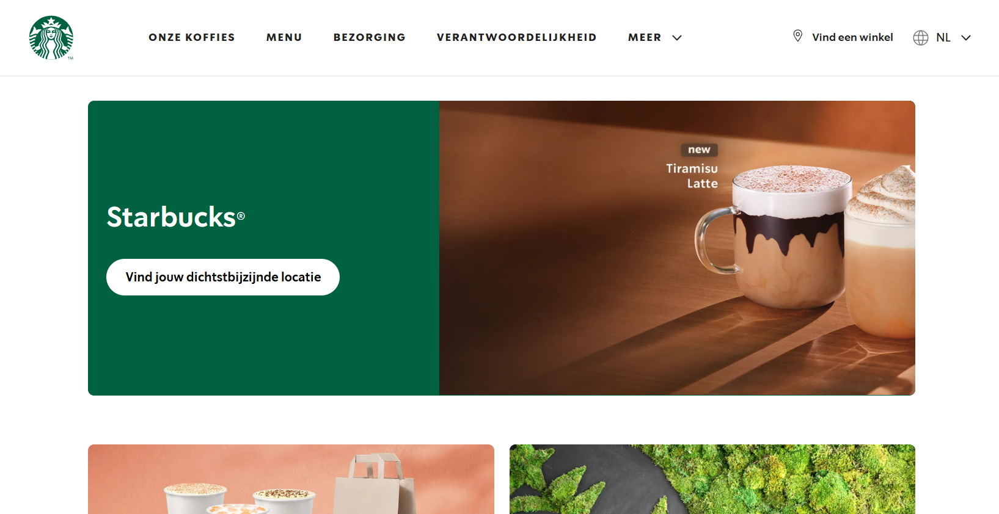
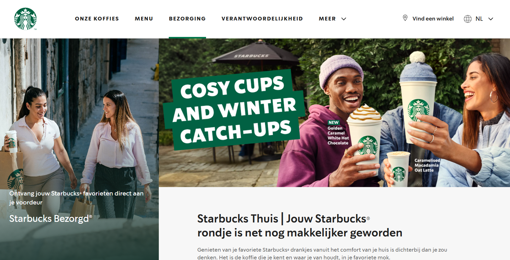
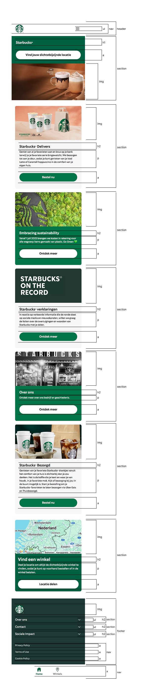

# Procesverslag
Markdown is een simpele manier om HTML te schrijven.  
Markdown cheat cheet: [Hulp bij het schrijven van Markdown](https://github.com/adam-p/markdown-here/wiki/Markdown-Cheatsheet).

Nb. De standaardstructuur en de spartaanse opmaak van de README.md zijn helemaal prima. Het gaat om de inhoud van je procesverslag. Besteedt de tijd voor pracht en praal aan je website.

Nb. Door *open* toe te voegen aan een *details* element kun je deze standaard open zetten. Fijn om dat steeds voor de relevante stuk(ken) te doen.

## Jij

  
uitwerken voor kick-off werkgroep

  ### Auteur:
  Demi Willemsen

  #### Je startniveau:
  Blauw

  #### Je focus:
  Responsive
 

## Je website

  
uitwerken voor kick-off werkgroep

  ### Je opdracht:
  https://www.starbucks.nl/nl
  
  #### Screenshot(s) van de eerste pagina (small screen): 
  Home pagina 
  

  #### Screenshot(s) van de tweede pagina (small screen):
  Bezorg pagina 
  
 

## Toegankelijkheidstest 1/2 (week 1)

  
uitwerken na test in 2e werkgroep

  ### Bevindingen
  Lijst met je bevindingen die in de test naar voren kwamen:

  * De website maakt (te) veel gebruik van div's en classes etc. De code is niet netjes/semantisch.
  * De website is erg overzichtelijk, en gebruiksvriendelijk als het gaat om de lay-out. De knoppen(buttons) zijn de juiste groote op de telefoon.
  * Als je de website groter en kleiner maakt schuift alles op de juiste manier mee, niks blijft raar hangen of iets dergelijks.
  * De website maakt vrijwel geen gebruik van H1's (dus niet op elke pagina komt een H1 voor), voornamelijk heel veel h2's.
  * Niet elke img elements heeft een alt.
  * De website maakt geen gebruik van a elementen voor links.
  * Niet elke link is herkenbaar als link.
  * De website maakt vrijwel geen gebruik van button elementen voor buttons.

## Breakdownschets (week 1)

  
uitwerken na afloop 3e werkgroep

  ### de hele pagina: 
  

  ### dynamisch deel (bijv menu): 
  

  ### wellicht nog een dynamisch deel (bijv filter): 
  

## Voortgang 1 (week 2)

  
uitwerken voor 1e voortgang

  ### Stand van zaken
  hier dit ging goed & dit was lastig (neem ook screenshots op van delen van je website en code)

  het was voornamelijk heel erg inkomen in de code. Ik ben er niet goed in, dus was het extra lastig. nadat ik eenmaal een opzetje had ging het redelijk. Wat goed ging is dat wat ik deed ik ook terug zag op mijn site, dus geen errors of iets dergelijks. wat ik lastig vind, blijft voornamelijk het netjes opstellen van een code.

  ### Agenda voor meeting
  samen met je groepje opstellen

  | student 1      | student 2          | student 3    | student 4        |
  | ---            | ---                | ---          | ---              |
  | dit bespreken  | en dit             | en ik dit    | en dan ik dat    |
  | en dat ook nog | dit als er tijd is | nog een punt | dit wil ik zeker |
  | ...            | ...                | ...          | ...              |

  vragen van groepje:
  * melih: hoe maak ik mijn site responsive
  * bo: hoe maak ik een soort sarrousel met pijltjes, of dat met CSS of JS moet?
  * Eva: hoe kan ik mijn site stelen + implementeren in mijn html
  * mick: ziek
  * demi: hoe kan ik de kaart op een website gebruikbaar maken, dat je kan in en uitzoomen etc.

  ### Verslag van meeting
  hier na afloop snel de uitkomsten van de meeting vastleggen

  - Ik weet nu hoe ik de kaart in kan laden op mijn website. 
  - Ik weet nu dat veel websites svg gebruiken en zelf maken om icoontjes toe te passen op hun website. Dit ga ik zeker meenemen in mijn website, want starbucks maakt ook gebruik van svg icoontjes. Op die manier hoef ik niet moeilijk te doen met icoontjes zelf maken en inladen als png, want dat gaat uiteindelijk niet goed werken.
  - Ik weet nu dat als je wilt dat de screenreader een woord op z'n engels uitspreekt, dat je er lang:"en" aan toe kan voegen. Op die manier word het woord op zijn Engels uitgesproken.
  - Ik weet nu ook dat we op z'n minst 3 css stylepagina's moeten inleveren. 1 voor de basis, dus de kleuren, font, header en footer, want die zijn op elke pagina hetzelfde. 1 voor de main van de ene pagina, en 1 voor de main van de andere pagina.

## Voortgang 2 (week 3)

  
uitwerken voor 2e voortgang

  ### Stand van zaken
  hier dit ging goed & dit was lastig (neem ook screenshots op van delen van je website en code)

  Ik ben eigenlijk vooral bezig geweest met mijn HTML, allebei de pagina's. Ik wilde eerst die beide helemaal goed hebben voordat ik begon met mijn CSS. Want in mijn hoofd vond ik het fijner om eerst mijn HTML helemaal te begrijpen ipv HTML en dan weer CSS en dan weer terug naar HTML. Nu heb ik beide pagina's zo goed als af, alle inhoud wat op de officiele Starbucks website staat, staat nu ook in mijn HTML, dus nu zou ik aan de slag kunnen met CSS en JS. Wat ik lastig vond is hoe ik alles netjes opschrijf, dus als ik bijvoorbeeld een svg van de Starbucks website afhaalde, hoe ik dat dan netjes in mijn code kan verwerken, na veel proberen en vragen ben ik er uitgekomen gelukkig. Nu hoop ik, en denk ik, dat mijn HTML helemaal netjes is. Dat is dan ook de vraag die ik wil gaan stellen tijdens dit voortgangsgesprek. Zodra ik weet dat mijn HTML helemaal netjes is ga ik aan de slag met CSS en JS.

  ### Agenda voor meeting
  samen met je groepje opstellen

  | student 1      | student 2          | student 3    | student 4        |
  | ---            | ---                | ---          | ---              |
  | dit bespreken  | en dit             | en ik dit    | en dan ik dat    |
  | en dat ook nog | dit als er tijd is | nog een punt | dit wil ik zeker |
  | ...            | ...                | ...          | ...              |

  vragen van groepje:
  * melih: Geen vraag
  * bo: 
  * Eva: Is mijn HTML netjes in elkaar gezet, en hoe zet ik mijn eerste sectie netjes in elkaar?
  * mick: 
  * demi: Is mijn HTML netjes in elkaar gezet?

  ### Verslag van meeting
  hier na afloop snel de uitkomsten van de meeting vastleggen

  - Ik weet nu dat mijn html goed in elkaar is gezet, en dat ik verder kan gaan met CSS opbouwen
  - Ik weet nu dat het handig is om de website helemaal te verbeteren, op de onze koffies pagina van starbucks staat alles in principe in het nederlands tot je onder aan de pagina aankomt bij het stappenplan om zelf een koffie te maken, daar staat alles in het engels. Dus dat ga ik verbeteren naar het Nederlands zodat de hele pagina gewoon in het Nederlands staat. Dit stond eerst in het Engels in mijn html, omdat ik het exact had overgenomen van de website.
  - Ook heb ik tips gekregen van de studentassistenten om te werken aan de h3 die onzichtbaar moet zijn in mijn footer. ik had daar eerst nog helemaal geen H-element, maar dat moet er wel in staan. Dus daar ga ik mee aan de slag.

## Toegankelijkheidstest 2/2 (week 4)

  
uitwerken na test in 9e werkgroep

  ### Bevindingen
  Lijst met je bevindingen die in de test naar voren kwamen (geef ook aan wat er verbeterd is):

## Voortgang 3 (week 4)

  
uitwerken voor 3e voortgang

  ### Stand van zaken
  hier dit ging goed & dit was lastig (neem ook screenshots op van delen van je website en code)

  ### Agenda voor meeting
  samen met je groepje opstellen

  | student 1      | student 2          | student 3    | student 4        |
  | ---            | ---                | ---          | ---              |
  | dit bespreken  | en dit             | en ik dit    | en dan ik dat    |
  | en dat ook nog | dit als er tijd is | nog een punt | dit wil ik zeker |
  | ...            | ...                | ...          | ...              |

  ### Verslag van meeting
  hier na afloop snel de uitkomsten van de meeting vastleggen

  - punt 1
  - punt 2
  - nog een punt
  - ...

## Eindgesprek (week 5)

  
uitwerken voor eindgesprek

  ### Je uitkomst - karakteristiek screenshots:
  

  ### Dit ging goed/Heb ik geleerd: 
  Korte omschrijving met plaatjes

  

  ### Dit was lastig/Is niet gelukt:
  Korte omschrijving met plaatjes

  

## Bronnenlijst

  
continu bijhouden terwijl je werkt

  Nb. Wees specifiek ('css-tricks' als bron is bijv. niet specifiek genoeg). 
  Nb. ChatGpT en andere AI horen er ook bij.
  Nb. Vermeld de bronnen ook in je code.

  1. Alle foto's komen van de officiele starbucks site: https://www.starbucks.nl/nl
  2. De kaart op de homepagina: https://www.google.nl/maps/?hl=nl
  3. Schaduw van de eerste afbeelding van de "onze koffies" pagina, geleerd via deze website: https://developer.mozilla.org/en-US/docs/Web/CSS/gradient
  4. 

